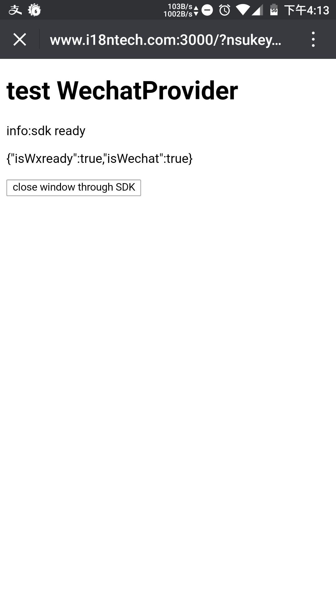
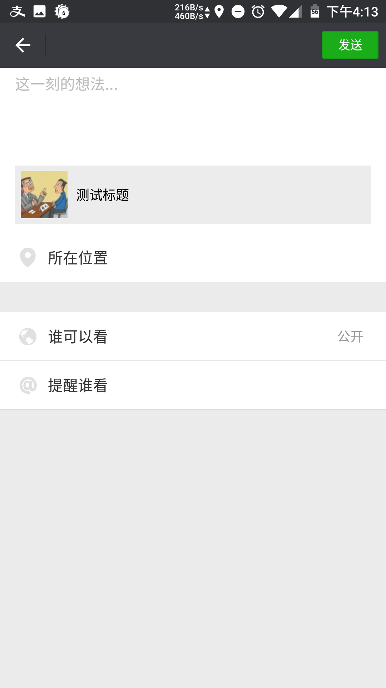

# react-wechat-provider

## usage | 使用

### Provider

```
import { Provider as WP } from 'react-wechat-provider'

export default () => (<div>
  <WP config={getConfig} success={success} error={(err) => alert('error')} debug={true}>
    <div>
      <h1>test WechatProvider</h1>
      <Example />
    </div>
  </WP>
</div>)
```

[refer ./example/pages/index.js for more detail | 更多](./example/pages/index.js)

### connect

```
import { Component } from 'react'
import { connect } from 'react-wechat-provider'

class Example extends Component {
  render() {
    const { isWxready, isWechat, wx } = this.props

    const data = JSON.stringify({
      isWxready,
      isWechat,
    })

    return (<div>
      <p>{data}</p>
      {isWxready && (<p>
        <button onClick={() => {
          wx.closeWindow()
        }}>close window through SDK</button>
      </p>)}
    </div>)
  }
}

export default connect(Example)
```

[refer ./example/components/Example.js for more detail | 更多](./example/components/Example.js)


## run example

.babelrc will cause conflict so move example someplace else

```
mv example ../
cd ../example
yarn
mv config-example.json config.json
# fill your wechat appid secret .etc | 填写微信appid secret等
vi config.json
yarn dev
```

then visit http://localhost:3000 | 然后访问 http://localhost:3000 

then bind a domain | 然后绑定一个域名

then add domain to your wechat safe domain | 然后添加这个域名到微信后台的安全域名

then visit http://domain:3000 in your wechat | 然后微信访问 http://domain:3000



